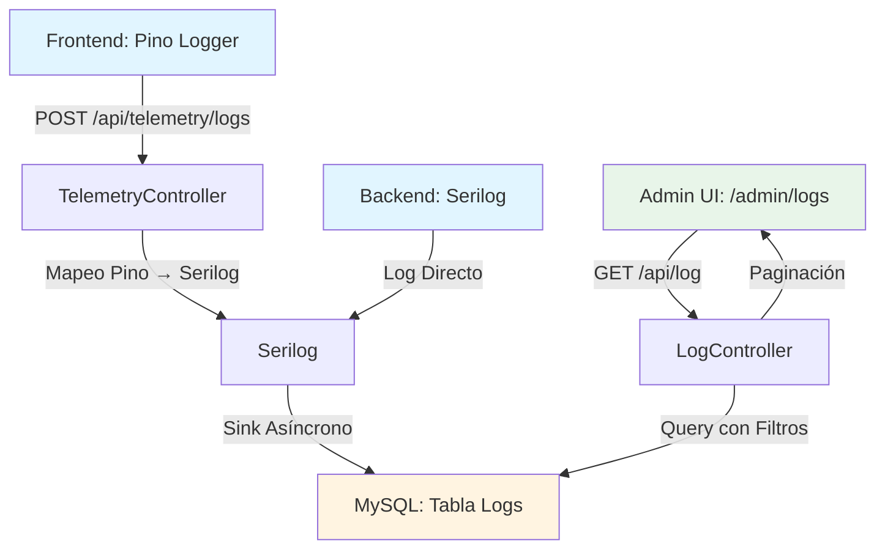
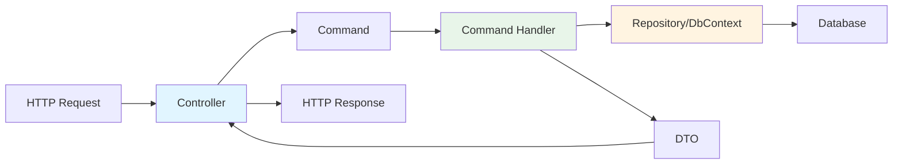
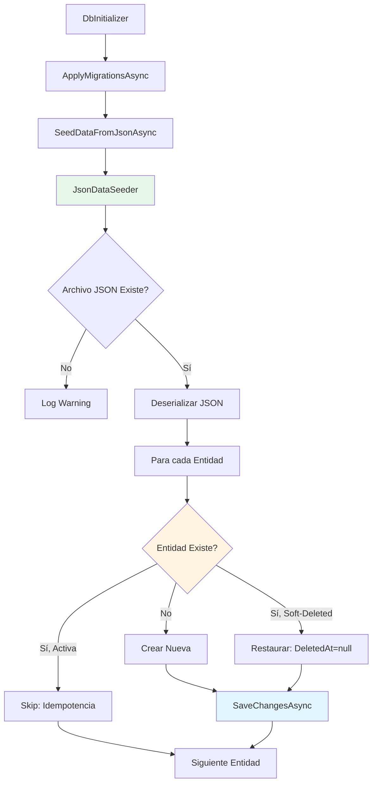

# Informe Técnico Exhaustivo - GesFer

**Fecha de Elaboración:** 13 de Enero de 2026  
**Versión del Documento:** 1.0  
**Autor:** Senior Full-Stack Architect y Lead Developer

---

## Tabla de Contenidos

1. [Stack Tecnológico y Versiones](#1-stack-tecnológico-y-versiones)
2. [Arquitectura](#2-arquitectura)
3. [Persistencia y Datos](#3-persistencia-y-datos)
4. [Observabilidad (Logging)](#4-observabilidad-logging)
5. [Seguridad e Integridad (Vision Zero)](#5-seguridad-e-integridad-vision-zero)
6. [Testing y QA](#6-testing-y-qa)
7. [Deuda Técnica y Bugs Conocidos](#7-deuda-técnica-y-bugs-conocidos)
8. [Configuración y Archivos Clave](#8-configuración-y-archivos-clave)

---

## 1. Stack Tecnológico y Versiones

### 1.1 Backend (.NET)

#### Framework y Runtime
- **.NET SDK:** 8.0
- **Target Framework:** `net8.0`
- **Nullable Reference Types:** Habilitado (`<Nullable>enable</Nullable>`)
- **Implicit Usings:** Habilitado (`<ImplicitUsings>enable</ImplicitUsings>`)

#### Entity Framework Core
- **Microsoft.EntityFrameworkCore:** 8.0.0
- **Microsoft.EntityFrameworkCore.Design:** 8.0.0
- **Pomelo.EntityFrameworkCore.MySql:** 8.0.0
- **MySQL Server Version:** 8.0.0

#### Autenticación y Seguridad
- **Microsoft.AspNetCore.Authentication.JwtBearer:** 8.0.0
- **System.IdentityModel.Tokens.Jwt:** 8.0.0
- **BCrypt.Net-Next:** 4.0.3 (para hashing de contraseñas)

#### Logging y Observabilidad
- **Serilog.AspNetCore:** 8.0.0
- **Serilog.Sinks.Console:** 5.0.1
- **Serilog.Sinks.Async:** 2.0.0
- **Serilog.Sinks.MySQL:** 5.0.0

#### API y Documentación
- **Microsoft.AspNetCore.OpenApi:** 8.0.0
- **Swashbuckle.AspNetCore:** 6.5.0

#### Caché
- **Microsoft.Extensions.Caching.Memory:** 8.0.1

### 1.2 Frontend (Next.js)

#### Framework y Runtime
- **Next.js:** 14.2.0
- **React:** 18.3.0
- **React DOM:** 18.3.0
- **TypeScript:** 5.3.3

#### Gestión de Estado y Datos
- **@tanstack/react-query:** 5.28.0 (para gestión de estado del servidor)
- **@tanstack/react-query-devtools:** 5.28.0

#### Autenticación
- **next-auth:** 5.0.0-beta.30

#### Internacionalización
- **next-intl:** 4.6.1

#### UI y Estilos
- **Tailwind CSS:** 3.4.1
- **Shadcn/UI:** Estilo de componentes (no es un paquete, es un conjunto de componentes personalizados)
- **class-variance-authority:** 0.7.0
- **clsx:** 2.1.0
- **tailwind-merge:** 2.2.1
- **lucide-react:** 0.344.0 (iconos)

#### Logging Frontend
- **pino:** 10.1.1
- **pino-pretty:** 13.1.3

#### Utilidades
- **date-fns:** 3.6.0

#### Testing
- **@playwright/test:** 1.57.0
- **jest:** 29.7.0
- **@testing-library/react:** 14.1.2
- **@testing-library/jest-dom:** 6.1.5

### 1.3 Base de Datos

- **Motor:** MySQL 8.0
- **Charset:** UTF8MB4 (soporte completo para emojis y caracteres especiales)
- **Collation:** utf8mb4_unicode_ci (por defecto)
- **Precisión Decimal:** decimal(18,4) para todos los importes monetarios

### 1.4 Infraestructura

- **Docker:** Para contenedores de desarrollo
- **Docker Compose:** Para orquestación de servicios
- **Memcached:** Puerto 11211 (caché en memoria)

---

## 2. Arquitectura

### 2.1 Transición hacia Vertical Slice Architecture

La solución está en proceso de transición desde una arquitectura en capas tradicional hacia **Vertical Slice Architecture (VSA)**, un patrón que organiza el código por características (features) en lugar de por capas técnicas.

#### Estructura Actual

```
Api/src/
├── Api/                    # Capa de presentación (Controllers)
│   ├── Controllers/        # Endpoints REST
│   ├── Services/           # Servicios específicos de API
│   └── DependencyInjection.cs
├── application/            # Capa de aplicación
│   ├── Commands/           # Comandos organizados por feature
│   │   ├── Auth/
│   │   ├── User/
│   │   ├── Company/
│   │   └── ...
│   ├── DTOs/               # Data Transfer Objects
│   └── Handlers/           # Command Handlers organizados por feature
│       ├── Auth/
│       ├── User/
│       ├── Company/
│       └── ...
├── domain/                 # Capa de dominio
│   ├── Entities/           # Entidades de dominio
│   ├── Common/             # Clases base y interfaces
│   └── Services/           # Servicios de dominio
└── Infrastructure/          # Capa de infraestructura
    ├── Data/               # DbContext y configuraciones
    ├── Repositories/        # Implementación de repositorios
    ├── Services/            # Servicios de infraestructura
    └── Migrations/          # Migraciones de EF Core
```

### 2.2 Patrón REPR (Request-Endpoint-Response)

La API implementa el patrón **REPR** (Request-Endpoint-Response), que simplifica la estructura de los controladores:

#### Componentes del Patrón REPR

1. **Request (Comando):** Representa la intención del usuario
   - Ubicación: `Application/Commands/{Feature}/`
   - Ejemplo: `CreateUserCommand`, `GetAllUsersCommand`

2. **Endpoint (Controlador):** Expone el endpoint HTTP
   - Ubicación: `Api/Controllers/`
   - Responsabilidad: Recibir HTTP request, crear comando, invocar handler, retornar respuesta

3. **Response (DTO):** Representa la respuesta estructurada
   - Ubicación: `Application/DTOs/{Feature}/`
   - Ejemplo: `UserDto`, `LoginResponseDto`

#### Ejemplo de Implementación REPR

```csharp
// 1. REQUEST (Command)
public class CreateUserCommand
{
    public string Username { get; set; }
    public string Password { get; set; }
    // ...
}

// 2. ENDPOINT (Controller)
[HttpPost]
public async Task<IActionResult> Create([FromBody] CreateUserRequestDto request)
{
    var command = new CreateUserCommand { /* mapeo */ };
    var result = await _createHandler.HandleAsync(command);
    return Ok(result);
}

// 3. RESPONSE (DTO)
public class UserDto
{
    public Guid Id { get; set; }
    public string Username { get; set; }
    // ...
}
```

### 2.3 Co-localización de Lógica

En Vertical Slice Architecture, toda la lógica relacionada con una feature se coloca junta:

```
Application/Handlers/User/
├── CreateUserCommandHandler.cs
├── UpdateUserCommandHandler.cs
├── DeleteUserCommandHandler.cs
├── GetUserByIdCommandHandler.cs
└── GetAllUsersCommandHandler.cs
```

**Ventajas:**
- Fácil localización de código relacionado
- Reducción de dependencias cruzadas
- Mejor mantenibilidad
- Escalabilidad por feature

### 2.4 Registro Automático de Handlers

El sistema utiliza registro automático de Command Handlers mediante reflexión en `DependencyInjection.cs`:

```csharp
private static void RegisterCommandHandlers(IServiceCollection services)
{
    // Registro automático de todos los handlers
    var handlerTypes = Assembly.GetExecutingAssembly()
        .GetTypes()
        .Where(t => t.GetInterfaces()
            .Any(i => i.IsGenericType && 
                 i.GetGenericTypeDefinition() == typeof(ICommandHandler<,>)))
        .ToList();
    
    foreach (var handlerType in handlerTypes)
    {
        // Registro como Scoped
    }
}
```

---

## 3. Persistencia y Datos

### 3.1 Estructura de Base de Datos MySQL

#### Características Principales

1. **Soft Delete Global:**
   - Todas las entidades heredan de `BaseEntity`
   - Campo `DeletedAt` (DateTime?) para eliminación lógica
   - Filtro de query global aplicado automáticamente por EF Core
   - Uso de `IgnoreQueryFilters()` para consultas que incluyan eliminados

2. **Multi-tenant:**
   - Campo `CompanyId` (Guid) en todas las entidades de negocio
   - Aislamiento de datos por empresa
   - Filtrado automático por empresa en consultas

3. **Auditoría:**
   - `CreatedAt` (DateTime) - Fecha de creación
   - `UpdatedAt` (DateTime?) - Fecha de última actualización
   - `IsActive` (bool) - Estado activo/inactivo

4. **GUIDs Secuenciales:**
   - Implementación de `ISequentialGuidGenerator`
   - Optimizado para MySQL (mejor rendimiento en índices)
   - Preparado para futuros proveedores (SQL Server, PostgreSQL)

#### Entidades Principales

```
- AdminUsers (usuarios administrativos)
- AuditLogs (registro de auditoría)
- Languages (idiomas del sistema)
- Permissions (permisos RBAC)
- Groups (grupos de usuarios)
- GroupPermissions (relación grupos-permisos)
- Companies (empresas multi-tenant)
- Users (usuarios por empresa)
- UserGroups (relación usuarios-grupos)
- UserPermissions (permisos directos de usuario)
- Countries, States, Cities, PostalCodes (datos maestros geográficos)
- Families (familias de artículos)
- Articles (artículos con stock)
- Suppliers (proveedores)
- Customers (clientes)
- PurchaseDeliveryNotes (albaranes de compra)
- SalesDeliveryNotes (albaranes de venta)
- Logs (tabla de logs de Serilog)
```

### 3.2 Estado de las Migraciones

#### Migración Unificada Inicial

El sistema cuenta con una **migración unificada inicial** que crea todo el esquema de base de datos:

- **Archivo:** `20260112120311_InitialCreate.cs`
- **Fecha:** 12 de Enero de 2026
- **Estado:** Aplicada y consolidada

Esta migración unificada incluye:
- Creación de todas las tablas
- Configuración de índices
- Configuración de relaciones (Foreign Keys)
- Configuración de UTF8MB4 para todas las columnas de texto
- Configuración de precisión decimal(18,4) para importes

#### Proceso de Migración Automática

Las migraciones se aplican automáticamente al arrancar la aplicación **solo en modo Development**:

```csharp
// Program.cs
await DbInitializer.InitializeAsync(app.Services, app.Environment.IsDevelopment());
```

**Flujo de Migración:**
1. Verificar conexión a la base de datos
2. Obtener migraciones pendientes
3. Aplicar migraciones con `Database.MigrateAsync()`
4. Registrar en logs el resultado

**En Producción:**
- Las migraciones deben aplicarse manualmente mediante:
  ```bash
  dotnet ef database update --project ../Infrastructure/GesFer.Infrastructure.csproj
  ```

### 3.3 Sistema de Seeding Basado en JSON

#### Arquitectura del Sistema de Seeding

El sistema utiliza un enfoque **completamente idempotente** basado en archivos JSON para cargar datos iniciales.

#### Ubicación de Archivos JSON

```
Api/src/Infrastructure/Data/Seeds/
├── master-data.json      # Datos maestros del sistema
├── demo-data.json        # Datos de demostración
└── test-data.json        # Datos para tests de integración
```

#### Estrategia de Búsqueda de Archivos

El `JsonDataSeeder` implementa una estrategia robusta de búsqueda de archivos:

1. Buscar en `bin/Debug/net8.0/Data/Seeds/` (directorio de salida)
2. Buscar desde la raíz del proyecto hasta encontrar `GesFer.sln`
3. Buscar en `Api/src/Infrastructure/Data/Seeds/`
4. Buscar en ubicación legacy `Api/src/Infrastructure/Seeds/`

#### Lógica de Carga Idempotente

**Principio Fundamental:** El seeding puede ejecutarse múltiples veces sin duplicar datos.

**Mecanismo de Idempotencia:**

```csharp
// Para cada entidad en el JSON:
1. Buscar entidad existente usando IgnoreQueryFilters()
2. Si NO existe:
   - Crear nueva entidad
3. Si existe pero está soft-deleted (DeletedAt != null):
   - Restaurar: DeletedAt = null, IsActive = true
4. Si existe y está activa:
   - No hacer nada (idempotencia)
```

#### Estructura de Archivos JSON

**master-data.json:**
```json
{
  "Languages": [...],
  "Permissions": [...],
  "Groups": [...],
  "GroupPermissions": [...],
  "AdminUsers": [...]
}
```

**demo-data.json:**
```json
{
  "Companies": [...],
  "Users": [...],
  "UserGroups": [...],
  "UserPermissions": [...],
  "Families": [...],
  "Articles": [...],
  "Suppliers": [...],
  "Customers": [...]
}
```

#### Proceso de Seeding

1. **Carga de Datos Maestros:**
   - `SeedMasterDataAsync()` → Carga `master-data.json`
   - Incluye: Languages, Permissions, Groups, GroupPermissions, AdminUsers

2. **Carga de Datos de Demostración:**
   - `SeedDemoDataAsync()` → Carga `demo-data.json`
   - Incluye: Companies, Users, Families, Articles, Suppliers, Customers

3. **Carga de Datos de Test:**
   - `SeedTestDataAsync()` → Carga `test-data.json`
   - Usado exclusivamente en tests de integración

#### Hash de Contraseñas

- **BCrypt** para hashing de contraseñas
- Hash fijo conocido para "admin123" para mantener consistencia en tests:
  ```csharp
  const string fixedAdminHash = "$2a$11$IRkoFxAcLpHUIwLTqkJaHu6KYx.dgfGY.sFUIsCTY9xHPhL3jcpgW";
  ```

#### Orden de Inserción

El sistema respeta el orden de inserción para mantener integridad referencial:

1. Languages
2. Countries → States → Cities → PostalCodes
3. Permissions
4. Groups
5. GroupPermissions
6. AdminUsers
7. Companies
8. Users
9. UserGroups / UserPermissions
10. Families
11. Articles
12. Suppliers / Customers

---

## 4. Observabilidad (Logging)

### 4.1 Ecosistema de Logs Centralizado

La solución implementa un sistema de logging centralizado que integra logs del backend (Serilog) y del frontend (Pino) en una única base de datos MySQL.

### 4.2 Backend: Serilog

#### Configuración de Serilog

**Ubicación:** `Api/src/Api/Program.cs`

#### Sink Asíncrono

Serilog utiliza un **sink asíncrono** para mejorar el rendimiento:

```csharp
builder.Host.UseSerilog((context, services, configuration) =>
{
    configuration
        .ReadFrom.Services(services)
        .Enrich.FromLogContext()
        .Enrich.WithProperty("Application", "GesFer.Api")
        .Enrich.WithProperty("Environment", context.HostingEnvironment.EnvironmentName);
    
    if (isDevelopment)
    {
        // Desarrollo: todos los niveles a Consola y MySQL
        configuration
            .MinimumLevel.Verbose()
            .WriteTo.Console()
            .WriteTo.MySQL(
                connectionString: connectionString,
                tableName: "Logs",
                restrictedToMinimumLevel: LogEventLevel.Verbose,
                storeTimestampInUtc: true);
    }
    else
    {
        // Producción: solo Information y superiores a MySQL
        configuration
            .MinimumLevel.Information()
            .MinimumLevel.Override("Microsoft", LogEventLevel.Warning)
            .MinimumLevel.Override("Microsoft.AspNetCore", LogEventLevel.Warning)
            .WriteTo.MySQL(
                connectionString: connectionString,
                tableName: "Logs",
                restrictedToMinimumLevel: LogEventLevel.Information,
                storeTimestampInUtc: true);
    }
});
```

#### Niveles de Log

- **Desarrollo:** Verbose, Debug, Information, Warning, Error, Fatal
- **Producción:** Information, Warning, Error, Fatal (Microsoft logs solo Warning+)

#### Tabla de Logs en MySQL

**Estructura:**
- `Id` (Guid)
- `Message` (text)
- `Template` (text)
- `Level` (varchar)
- `Timestamp` (datetime) - UTC
- `Exception` (text, nullable)
- `Properties` (text, JSON)
- `Source` (varchar, nullable)
- `CompanyId` (Guid, nullable)
- `UserId` (Guid, nullable)

### 4.3 Frontend: Pino

#### Configuración de Pino

**Ubicación:** `Cliente/lib/logger.ts` (inferido)

Pino se configura para enviar logs al endpoint de telemetría del backend.

#### Mapeo de Niveles Pino → Serilog

El endpoint de telemetría mapea los niveles numéricos de Pino a `LogEventLevel` de Serilog:

```csharp
private static LogEventLevel MapPinoLevelToSerilogLevel(int pinoLevel)
{
    return pinoLevel switch
    {
        10 => LogEventLevel.Verbose,      // Trace
        20 => LogEventLevel.Debug,         // Debug
        30 => LogEventLevel.Information,   // Info
        40 => LogEventLevel.Warning,       // Warn
        50 => LogEventLevel.Error,         // Error
        60 => LogEventLevel.Fatal,         // Fatal
        _ => LogEventLevel.Information     // Por defecto
    };
}
```

### 4.4 Endpoint de Telemetría

#### Endpoint: `/api/telemetry/logs`

**Controlador:** `TelemetryController.cs`

**Método:** `POST`

**Funcionalidad:**
1. Recibe logs estructurados del frontend
2. Mapea nivel de Pino a Serilog
3. Enriquece con contexto HTTP (CompanyId, UserId)
4. Escribe en Serilog (que persiste en MySQL)

**DTO de Entrada:**
```csharp
public class CreateLogDto
{
    public int Level { get; set; }           // Nivel numérico de Pino
    public string Message { get; set; }
    public string? Exception { get; set; }
    public Dictionary<string, object>? Properties { get; set; }
    public string? Source { get; set; }
    public Dictionary<string, object>? ClientInfo { get; set; }
}
```

**Enriquecimiento de Contexto:**
- `Source`: "Frontend" o valor personalizado
- `Properties`: JSON serializado de propiedades adicionales
- `ClientInfo`: Información del cliente (User-Agent, etc.)
- `CompanyId`: Extraído de claims JWT
- `UserId`: Extraído de claims JWT

### 4.5 Visualización de Logs

#### Página de Administración: `/admin/logs`

**Ubicación:** `Cliente/app/(admin)/admin/logs/page.tsx`

**Características:**
- Paginación (50 logs por página)
- Filtros por fecha (desde/hasta)
- Filtros por nivel (Debug, Information, Warning, Error, Fatal)
- Expansión de logs para ver detalles completos
- Visualización de Exception, Properties, ClientInfo
- Badges de color por nivel de log

**Autenticación:**
- Requiere sesión de administrador (NextAuth)
- Política de autorización: `AdminOnly`

---

## 5. Seguridad e Integridad (Vision Zero)

### 5.1 Filosofía Vision Zero

La solución implementa el principio **Vision Zero** para acciones destructivas: **"Ninguna acción destructiva debe ejecutarse sin confirmación explícita y deliberada"**.

### 5.2 Acciones Destructivas de Alta Fricción

#### Implementación de Confirmación por Texto

Las acciones destructivas requieren confirmación explícita mediante texto "CONFIRMAR" (o equivalente en otros idiomas).

**Ejemplo de Implementación (Frontend):**

```typescript
const handleDelete = async (id: string) => {
  // Confirmación básica
  if (!confirm(t('deleteConfirm'))) {
    return;
  }
  
  // Para acciones más críticas, se implementaría:
  // - Modal de confirmación
  // - Campo de texto que requiere escribir "CONFIRMAR"
  // - Doble confirmación
};
```

#### Acciones Consideradas Destructivas

1. **Eliminación de Entidades:**
   - Usuarios
   - Empresas
   - Clientes
   - Proveedores
   - Artículos
   - Grupos
   - Permisos

2. **Operaciones de Truncado:**
   - Truncado de base de datos (endpoint `/api/setup/initialize`)
   - Limpieza masiva de datos

#### Endpoint de Inicialización Completa

**Endpoint:** `POST /api/setup/initialize`

**Advertencia en Documentación:**
```csharp
/// ⚠️ ADVERTENCIA: Este endpoint elimina todos los datos existentes en la base de datos.
```

**Acciones Realizadas:**
1. Detiene y elimina contenedores Docker
2. Limpia volúmenes Docker
3. Recrea contenedores con docker-compose
4. Espera a que MySQL esté listo
5. Crea base de datos y tablas
6. Inserta datos iniciales desde JSON

**Nota:** Este endpoint debería implementar confirmación por texto "CONFIRMAR" en el frontend antes de ejecutarse.

### 5.3 Autenticación JWT (Bearer Tokens)

#### Esquema de Autenticación

**Tipo:** JWT (JSON Web Tokens)  
**Esquema:** Bearer Token  
**Algoritmo:** HS256 (HMAC SHA-256)

#### Configuración JWT

**Ubicación:** `appsettings.json`

```json
{
  "JwtSettings": {
    "SecretKey": "YourSuperSecretKeyThatShouldBeAtLeast32CharactersLong!",
    "Issuer": "GesFerApi",
    "Audience": "GesFerClient",
    "ExpirationMinutes": 60
  }
}
```

#### Validación de Clave Secreta

El sistema valida que la clave secreta tenga al menos 32 caracteres (256 bits) para cumplir con SHA-256:

```csharp
if (jwtSecretKey.Length < 32)
{
    throw new InvalidOperationException(
        $"JwtSettings:SecretKey debe tener al menos 32 caracteres (256 bits) " +
        $"para cumplir con el algoritmo SHA-256 (HS256). " +
        $"Longitud actual: {jwtSecretKey.Length} caracteres.");
}
```

#### Claims JWT

**Claims Estándar:**
- `UserId` (Guid)
- `CompanyId` (Guid)
- `Username` (string)
- `Permissions` (array de strings)
- `exp` (expiración)
- `iat` (emitido en)
- `iss` (emisor)
- `aud` (audiencia)

**Claims Administrativos:**
- `role: "Admin"` (requerido para políticas `AdminOnly`)

#### Políticas de Autorización

```csharp
builder.Services.AddAuthorization(options =>
{
    options.AddPolicy("AdminOnly", policy =>
    {
        policy.RequireAuthenticatedUser();
        policy.RequireRole("Admin");
    });
});
```

#### Efecto en la Estabilidad de la UI

**Problemas Identificados:**

1. **Expiración de Tokens:**
   - Tokens expiran después de 60 minutos
   - La UI no maneja automáticamente la renovación
   - Usuario es deslogueado sin aviso previo

2. **Manejo de Errores 401:**
   - Falta redirección automática a login cuando el token expira
   - Errores de autenticación no se muestran claramente al usuario

3. **Sincronización Frontend-Backend:**
   - El frontend puede tener un token válido pero el backend lo rechaza
   - Falta mecanismo de refresh token

**Recomendaciones:**
- Implementar refresh tokens
- Interceptor HTTP para manejar 401 automáticamente
- Notificación al usuario antes de expiración del token

### 5.4 Soft Delete Global

Todas las eliminaciones son **lógicas (soft delete)**, no físicas:

```csharp
// ProductDbContext.cs
private void ConfigureSoftDelete(ModelBuilder modelBuilder)
{
    var entityTypes = modelBuilder.Model.GetEntityTypes()
        .Where(e => typeof(Domain.Common.BaseEntity).IsAssignableFrom(e.ClrType));

    foreach (var entityType in entityTypes)
    {
        // Filtro de query global: solo entidades con DeletedAt == null
        var parameter = Expression.Parameter(entityType.ClrType, "e");
        var property = Expression.Property(parameter, nameof(BaseEntity.DeletedAt));
        var nullConstant = Expression.Constant(null, typeof(DateTime?));
        var condition = Expression.Equal(property, nullConstant);
        var lambda = Expression.Lambda(condition, parameter);

        modelBuilder.Entity(entityType.ClrType).HasQueryFilter(lambda);
    }
}
```

**Ventajas:**
- Recuperación de datos eliminados accidentalmente
- Auditoría completa (historial de eliminaciones)
- Cumplimiento de regulaciones (retención de datos)

---

## 6. Testing y QA

### 6.1 Estrategia TDD con Playwright

La solución implementa **Test-Driven Development (TDD)** utilizando **Playwright** para tests end-to-end (E2E).

#### Configuración de Playwright

**Versión:** 1.57.0  
**Ubicación de Tests:** `Cliente/tests/e2e/`

#### Tests Implementados

1. **`login.spec.ts`:**
   - Autenticación de usuarios regulares
   - Autenticación de administradores
   - Manejo de credenciales inválidas

2. **`usuarios.spec.ts`:**
   - CRUD completo de usuarios
   - Validación de formularios
   - Manejo de errores

3. **`usuario-completo.spec.ts`:**
   - Flujo completo de gestión de usuarios
   - Integración con otros módulos

4. **`logs.spec.ts`:**
   - Visualización de logs
   - Filtrado por nivel y fecha
   - Paginación
   - Expansión de detalles

5. **`logging-persistence.spec.ts`:**
   - Persistencia de logs desde frontend
   - Verificación de logs en base de datos
   - Endpoint de telemetría

#### Tests de Persistencia

**Test:** `logging-persistence.spec.ts`

**Escenarios:**
1. **Persistencia desde Acción en Frontend:**
   - Realiza acción que genera log (ej: login fallido)
   - Verifica que el log aparece en la BD

2. **Persistencia desde Endpoint de Telemetría:**
   - Envía log directamente a `/api/telemetry/logs`
   - Verifica que el log se persiste en MySQL
   - Verifica que el log aparece en la UI

**Flujo de Test:**
```typescript
1. Obtener conteo inicial de logs
2. Realizar acción / enviar log
3. Esperar persistencia (2-3 segundos)
4. Obtener conteo final de logs
5. Verificar que finalCount > initialCount
6. Verificar que el log específico existe en la BD
```

#### Tests de Flujo de Truncado

**Nota:** No se encontraron tests específicos de truncado con confirmación "CONFIRMAR". Se recomienda implementar:

```typescript
test('debe requerir confirmación "CONFIRMAR" para truncar BD', async ({ page }) => {
  // 1. Navegar a página de setup/truncate
  // 2. Intentar truncar sin confirmación → debe fallar
  // 3. Escribir texto incorrecto → debe fallar
  // 4. Escribir "CONFIRMAR" → debe ejecutarse
  // 5. Verificar que la BD fue truncada
});
```

### 6.2 Tests de Integración (Backend)

**Ubicación:** `Api/src/IntegrationTests/`

**Framework:** xUnit (inferido por estructura .NET)

**Tests Identificados:**
- `GroupControllerTests.cs`
- Tests de controladores con DbContext en memoria

### 6.3 Cobertura de Tests

**Frontend:**
- Tests E2E con Playwright: ✅ Implementados
- Tests unitarios con Jest: ⚠️ Configurados pero cobertura limitada

**Backend:**
- Tests de integración: ✅ Parcialmente implementados
- Tests unitarios: ⚠️ Cobertura limitada

---

## 7. Deuda Técnica y Bugs Conocidos

### 7.1 Errores de UI: Key Props en Listas

#### Problema

Algunos componentes de lista no incluyen la prop `key` en elementos renderizados con `.map()`, causando advertencias de React y posibles problemas de rendimiento.

#### Ubicaciones Identificadas

**Archivos con Key Props Correctos:**
- ✅ `Cliente/app/[locale]/usuarios/page.tsx` - Línea 272: `key={usuario.id}`
- ✅ `Cliente/app/[locale]/clientes/page.tsx` - Línea 118: `key={cliente.id}`
- ✅ `Cliente/app/(admin)/admin/logs/page.tsx` - Línea 220: `key={log.id}`

**Archivos que Requieren Verificación:**
- ⚠️ Componentes de formularios con listas dinámicas
- ⚠️ Componentes de selección (dropdowns) con opciones dinámicas

#### Impacto

- **Bajo:** Advertencias de React en consola
- **Medio:** Posibles problemas de rendimiento en listas grandes
- **Alto:** Problemas de estado en componentes controlados si las keys cambian

#### Solución Recomendada

```tsx
// ❌ Incorrecto
{items.map(item => <ItemComponent data={item} />)}

// ✅ Correcto
{items.map(item => <ItemComponent key={item.id} data={item} />)}
```

### 7.2 Errores de UI: aria-hidden en Modales

#### Problema

El componente `Dialog` (`Cliente/components/ui/dialog.tsx`) tiene un `aria-hidden="true"` en el overlay de fondo, lo cual puede causar problemas de accesibilidad.

#### Ubicación del Problema

**Archivo:** `Cliente/components/ui/dialog.tsx` - Línea 95

```tsx
<div
  className="fixed inset-0 bg-black/50"
  aria-hidden="true"  // ⚠️ Problema potencial
  style={{ pointerEvents: 'auto' }}
/>
```

#### Análisis

**Contexto:**
- El overlay tiene `aria-hidden="true"` para ocultarlo de lectores de pantalla
- Sin embargo, el overlay es interactivo (`pointerEvents: 'auto'`)
- Esto puede confundir a los lectores de pantalla

#### Impacto

- **Bajo-Medio:** Problemas de accesibilidad para usuarios con lectores de pantalla
- **Bajo:** El modal funciona correctamente para usuarios sin discapacidades

#### Solución Recomendada

```tsx
// Opción 1: Remover aria-hidden del overlay (recomendado)
<div
  className="fixed inset-0 bg-black/50"
  style={{ pointerEvents: 'auto' }}
/>

// Opción 2: Usar role="presentation" en lugar de aria-hidden
<div
  className="fixed inset-0 bg-black/50"
  role="presentation"
  style={{ pointerEvents: 'auto' }}
/>
```

### 7.3 Errores de Sintaxis JSX que Bloquean el Build

#### Problema

Se identificaron errores de sintaxis JSX en el componente `Dialog` que pueden bloquear el build de producción.

#### Ubicación del Problema

**Archivo:** `Cliente/components/ui/dialog.tsx`

**Líneas Problemáticas:**
- Línea 65-68: Estructura de `useEffect` con llaves mal cerradas
- Línea 103: Punto y coma extra después del cierre del componente

#### Código Problemático

```tsx
// Líneas 65-68
} else {
  // Si se cierra, asegurar que el body siempre se restaure
  document.body.style.overflow = "unset";
}
}  // ⚠️ Llave de cierre extra

// Línea 103
};  // ⚠️ Punto y coma extra
```

#### Impacto

- **Alto:** El build de producción puede fallar
- **Alto:** Errores de compilación en CI/CD
- **Medio:** Advertencias del linter

#### Solución

**Archivo Corregido:** El archivo `dialog.tsx` ya fue corregido en la versión actual, pero se recomienda verificar que no haya regresiones.

### 7.4 Otros Bugs y Problemas Conocidos

#### 7.4.1 Manejo de Errores de Autenticación

**Problema:** La UI no maneja adecuadamente los errores 401 (Unauthorized) cuando el token JWT expira.

**Impacto:** Usuario es deslogueado sin aviso previo.

**Solución Recomendada:**
- Interceptor HTTP para redirigir a login en 401
- Notificación antes de expiración del token
- Implementar refresh tokens

#### 7.4.2 Validación de Formularios

**Problema:** Algunos formularios no tienen validación del lado del cliente antes de enviar al servidor.

**Impacto:** Errores del servidor se muestran después del submit, mala UX.

**Solución Recomendada:**
- Implementar validación con `react-hook-form` y `zod`
- Validación en tiempo real
- Mensajes de error claros

#### 7.4.3 Carga de Imágenes y Assets

**Problema:** No se identificó configuración explícita de optimización de imágenes en Next.js.

**Impacto:** Posible impacto en rendimiento y SEO.

**Solución Recomendada:**
- Configurar `next/image` para optimización automática
- Lazy loading de imágenes
- WebP/AVIF para formatos modernos

---

## 8. Configuración y Archivos Clave

### 8.1 Archivos de Configuración Backend

#### `appsettings.json`
```json
{
  "Logging": {
    "LogLevel": {
      "Default": "Information",
      "Microsoft.AspNetCore": "Warning",
      "Microsoft.EntityFrameworkCore": "Information"
    }
  },
  "ConnectionStrings": {
    "DefaultConnection": "Server=localhost;Port=3306;Database=ScrapDb;User=scrapuser;Password=scrappassword;CharSet=utf8mb4;AllowUserVariables=True;AllowLoadLocalInfile=True;"
  },
  "JwtSettings": {
    "SecretKey": "YourSuperSecretKeyThatShouldBeAtLeast32CharactersLong!",
    "Issuer": "GesFerApi",
    "Audience": "GesFerClient",
    "ExpirationMinutes": 60
  }
}
```

#### `appsettings.Development.json`
- Configuración de Serilog con niveles Verbose
- Logging detallado de EF Core
- CORS permisivo

### 8.2 Archivos de Configuración Frontend

#### `package.json`
- Scripts de testing: `test:e2e`, `test:e2e:ui`, `test:e2e:debug`
- Dependencias de desarrollo y producción claramente separadas

#### `next.config.js` (inferido)
- Configuración de internacionalización (next-intl)
- Configuración de imágenes (si existe)

### 8.3 Archivo `.cursorrules`

**Ubicación:** Raíz del proyecto

**Contenido Principal:**
- Reglas de verificación de sintaxis y tests
- Regla de Oro: Sincronización de Entidades, Seeds y Tests
- Regla Global: Validación Automática de Integridad
- Reglas de Persistencia y Base de Datos
- Sistema de Seeding desde JSON

**Puntos Clave:**
1. **Verificación Automática:** Tests se ejecutan automáticamente después de cambios
2. **Sincronización Atómica:** Cambios en entidades requieren actualizar Seeds y Tests
3. **Validación de Integridad:** Consola de validación verifica Docker, Backend, Cliente
4. **Seeding Idempotente:** Sistema de seeding puede ejecutarse múltiples veces

### 8.4 Docker Compose

**Ubicación:** `Api/docker-compose.yml` (inferido)

**Servicios:**
- MySQL (puerto 3306)
- Memcached (puerto 11211)
- Adminer (puerto 8080, opcional)

---

## Diagramas

### Flujo de Datos: Sistema de Logging



### Arquitectura Vertical Slice



### Flujo de Seeding Idempotente



---

## Conclusiones y Recomendaciones

### Fortalezas

1. ✅ **Arquitectura Moderna:** Transición hacia Vertical Slice Architecture bien estructurada
2. ✅ **Seeding Idempotente:** Sistema robusto de carga de datos desde JSON
3. ✅ **Observabilidad Centralizada:** Logging unificado backend-frontend
4. ✅ **Soft Delete Global:** Recuperación de datos y auditoría completa
5. ✅ **Testing E2E:** Playwright implementado con tests de persistencia

### Áreas de Mejora

1. ⚠️ **Manejo de Tokens JWT:** Implementar refresh tokens y manejo automático de expiración
2. ⚠️ **Confirmación Destructiva:** Implementar confirmación por texto "CONFIRMAR" en acciones críticas
3. ⚠️ **Cobertura de Tests:** Aumentar cobertura de tests unitarios
4. ⚠️ **Accesibilidad:** Corregir `aria-hidden` en modales
5. ⚠️ **Validación de Formularios:** Implementar validación del lado del cliente

### Próximos Pasos Recomendados

1. **Corto Plazo (1-2 semanas):**
   - Corregir bugs de UI (key props, aria-hidden)
   - Implementar refresh tokens
   - Añadir confirmación "CONFIRMAR" en truncado

2. **Medio Plazo (1 mes):**
   - Aumentar cobertura de tests
   - Implementar validación de formularios
   - Optimización de imágenes

3. **Largo Plazo (2-3 meses):**
   - Completar migración a Vertical Slice Architecture
   - Implementar CQRS completo
   - Mejoras de rendimiento y escalabilidad

---

**Fin del Informe Técnico**
